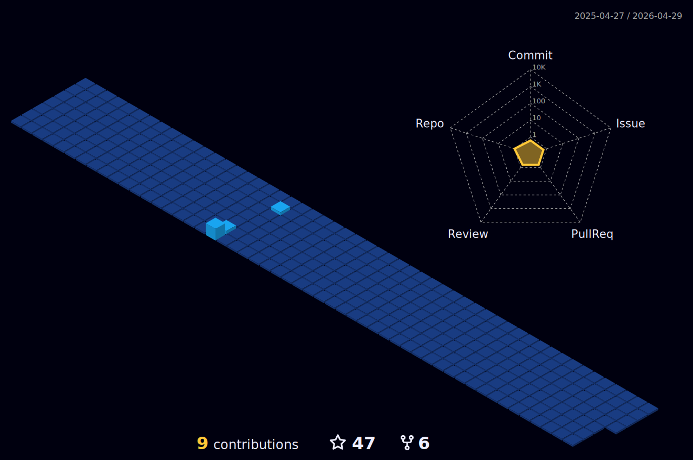

<!-- 

    

 -->

 
 
### Hello, there 

   
  Hi, I am a professional and passionate web and mobile developer with over 5 years of experience in remote work.
  
  During this period, I handled many Web and mobile projects using  React, Next.js, React-native, Native Android, Swift, Flutter, Tailwind, MUI, Google Firebase, and AWS.
  
  The work experience links above are some of my previous ones.
  
  If you provide a design, I can turn it into an app that perfectly matches your design (works on any device) and works just like a design prototype.
  
  I will do my best for your project and business goals and bring all my success and experience to your business.

 

  

    
<!-- - 💬 Telegram : [@pdev217](https://t.me/pdev217/);
- 📝 Email : sgirad86@gmail.com -->

<h3 align="left">Languages and Tools:</h3>

 
<!--     
    
    
     -->
    
    
    
    </a> 
    
      
                          
    
    
    
    
      

  

💗 **My Favorites Techs:**

   
<!-- 

    

 -->
<!--  -->

   

